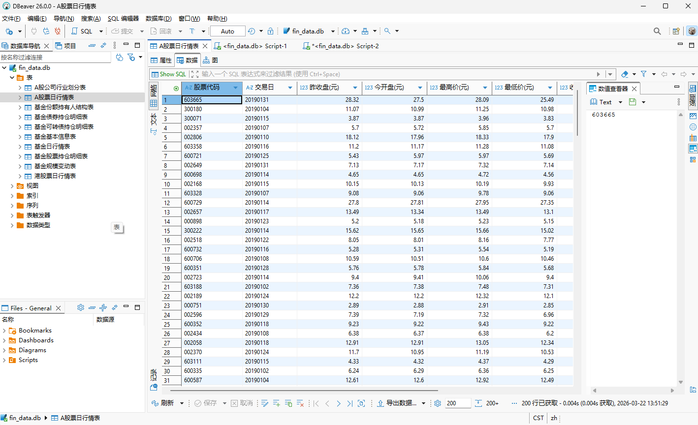
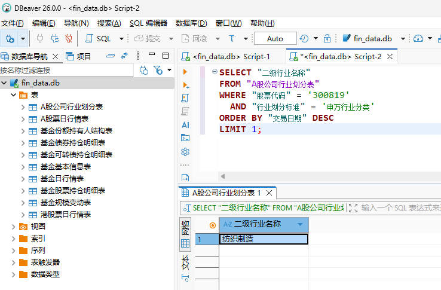

## 一、框架


## 二、所用设备
**系统:** windows 11

**CPU:** 13th Gen Intel(R) Core(TM) i7-13790F

**GPU:** NVIDIA GeForce RTX 2080 Ti 11G (仅用于SQL生成部分，Embedding模型运行在cpu上)

## 三、测试与结果

### 1. 构建向量数据库
```python
python -m scripts.run_data_prepare
```
**结果:**
```
>>> 准备文档...
>>> 构建向量库，共 105 个文档...
>>> 保存向量库到 E:\PAFinQASystem\PAFinQASystem\vector_store
```
--------------------------

### 2. 任务1：指标维度匹配
**描述：**

从下面所给的数据涉及的指标维度数据中，匹配question中出现的指标维度名：question中出现的词并不是数据库表中的标准原词，用时控制在2s之内，1s内最佳。

运用所提供 **"示例问题公开.xlsx"** 中的全部测试问题集进行指标匹配，观察其匹配时间。

**注：这一步并没有用到GPU，Embedding模型运行在CPU上。**

**命令：**
```python
python -m scripts.run_test_retrieve --input E:\PAFinQASystem\DATA\示例问题公开.xlsx >> .\results\log\run_test_retrieve.log
```
**全部结果见：**
* 结果文件，包含问题，检索到的指标名：[results/task1_retrieval_results.csv](results/task1_retrieval_results.csv)
* 脚本运行log文件：[results/log/run_test_retrieve.log](results/log/run_test_retrieve.log)

**部分结果如下:**
```
开始匹配，共 300 个问题...
================================================================================
已处理 1/300 个问题...
question:  请帮我计算，在20210105，中信行业分类划分的一级行业为综合金融行业中，涨跌幅最大股票的股票代码是？涨跌幅是多少？百分数保留两位小数。股票涨跌幅定义为：（收盘价 - 前一日收盘价 / 前一日收盘价）* 100%。
matched fields:  A股公司行业划分表-股票代码, A股票日行情表-股票代码, A股公司行业划分表-一级行业名称, A股票日行情表-成交量(股), A股票日行情表-最高价(元), 基金份额持有人结构表-报告类型, 基金份额持有人结构表-定期报告所属年度, 基金份额持有人结构表-个人投资者持有的基金份额占总份额比例, 基金份额持有人结构表-个人投资者持有的基金份额, 基金份额持有人结构表-机构投资者持有的基金份额占总份额比例
--------------------------------------------------
已处理 2/300 个问题...
question:  请帮我查询出20210415日，建筑材料一级行业涨幅超过5%（不包含）的股票数量。
matched fields:  A股公司行业划分表-股票代码, A股公司行业划分表-一级行业名称, A股公司行业划分表-二级行业名称, A股票日行情表-股票代码, A股票日行情表-成交量(股), A股公司行业划分表-交易日期, A股票日行情表-成交金额(元), 基金份额持有人结构表-报告类型, 基金份额持有人结构表-定期报告所属年度, 基金份额持有人结构表-个人投资者持有的基金份额占总份额比例
--------------------------------------------------

...

--------------------------------------------------
已处理 299/300 个问题...
question:  请查询：在20200518，属于申万二级景点行业的A股股票，它们的平均成交金额是多少？小数点后保留不超过5位。
matched fields:  A股票日行情表-成交金额(元), A股票日行情表-成交量(股), 港股票日行情表-成交金额(元), 港股票日行情表-成交量(股), A股公司行业划分表-股票代码, A股公司行业划分表-二级行业名称, A股公司行业划分表-交易日期, 基金份额持有人结构表-报告类型, 基金份额持有人结构表-定期报告所属年度, 基金份额持有人结构表-个人投资者持有的基金份额占总份额比例
--------------------------------------------------
已处理 300/300 个问题...
question:  20191226日，请给出民生加银聚益纯债债券基金的管理人和累计单位净值。
matched fields:  基金日行情表-资产净值, 基金日行情表-累计单位净值, 基金日行情表-单位净值, 基金债券持仓明细表-基金简称, 基金债券持仓明细表-持债市值, 基金份额持有人结构表-报告类型, 基金份额持有人结构表-定期报告所属年度, 基金份额持有人结构表-个人投资者持有的基金份额占总份额比例, 基金份额持有人结构表-个人投资者持有的基金份额, 基金份额持有人结构表-机构投资者持有的基金份额占总份额比例
--------------------------------------------------

结果已保存到: E:\PAFinQASystem\PAFinQASystem\results\task1_retrieval_results.csv

================================================================================
匹配统计结果:
================================================================================
问题总数: 300
最长匹配时间: 0.309s
最短匹配时间: 0.033s
平均匹配时间: 0.062s
总匹配时间: 18.642s
```

从300个问题匹配结果上看，平均匹配时间62ms，最长匹配时间0.3s，均能控制在1s内，平均耗时毫秒级，达到所要求的匹配时间性能要求。

--------------------------------


### 3. 任务2：SQL生成
**描述:**
基于上一步原词的识别结果，生成问题对应的SQL代码（用时10s以内，时间越短越好）。

#### 3.1 生成SQLite db文件
**命令：**
```python
python -m scripts.run_generate_db >> .\results\log\run_generate_db.log
```
生成的fin_data.db导入DBeaver结果如下：



#### 3.2 调用Coder大模型qwen3-coder-next进行测试(仅随机抽取100个问题)
**命令：**
```python
python -m scripts.run_test_sql_generate \
--input E:\PAFinQASystem\DATA\示例问题公开.xlsx \
--sample-size 100
--execute-sql True \
>> .\results\log\run_test_sql_generate_api.log
```
**全部结果见:**
* 结果文件，包括问题、生成的sql、用时、执行情况等信息：[task2_sql_generation_results_local.csv](results/task2_sql_generation_results_local.csv)
* 脚本运行log文件：[run_test_sql_generate_api.log](./results/log/run_test_sql_generate_api.log)

**部分结果如下：**
```
开始测试，共 300 个问题...
================================================================================
已处理 1/300 个问题...
question:  请帮我计算，在20210105，中信行业分类划分的一级行业为综合金融行业中，涨跌幅最大股票的股票代码是？涨跌幅是多少？百分数保留两位小数。股票涨跌幅定义为：（收盘价 - 前一日收盘价 / 前一日收盘价）* 100%。
generated sql: 
 SELECT 
    a."股票代码", 
    PRINTF('%.2f', ( CAST(a."收盘价(元)" AS REAL) - CAST(a."昨收盘(元)" AS REAL) ) / CAST(a."昨收盘(元)" AS REAL) * 100) AS "涨跌幅"
FROM 
    "A股票日行情表" a
JOIN 
    "A股公司行业划分表" b 
    ON a."股票代码" = b."股票代码"
WHERE 
    a."交易日" = '20210105'
    AND b."行业划分标准" = '中信行业分类'
    AND b."一级行业名称" = '综合金融'
ORDER BY 
    ( CAST(a."收盘价(元)" AS REAL) - CAST(a."昨收盘(元)" AS REAL) ) / CAST(a."昨收盘(元)" AS REAL) * 100 DESC
LIMIT 1;
first value: 
 {'股票代码': '600120', '涨跌幅': '0.00'}
generated sql time: 1.831

--------------------------------------------------
...

--------------------------------------------------

结果已保存到: E:\PAFinQASystem\PAFinQASystem\results\task2_sql_generation_results_api.csv

================================================================================
SQL生成测试统计结果:
================================================================================
问题总数: 100

时间统计:
SQL生成最长总耗时: 2.183s
SQL生成最短总耗时: 0.630s
SQL生成平均总耗时: 1.096s
SQL生成总耗时: 109.603s

测试完成！
```
从随机抽样的100个问题sql生成结果上看，平均用时1.096s，最长用时2.183s，均能控制在10s内，达到所要求的生成时间性能要求。

**SQL生成结果核对：**
* 若以生成的sql是否报错为基准，100个SQL共有3个不能运行，SQL生成成功率为97%;

以“我想知道股票300819在申万行业分类下的二级行业是什么？用最新的数据。”为例， 生成的sql查询出的结果如下：

----------------------------
#### 3.2 调用部署于本地通用大模型qwen3:8b进行测试(仅随机抽取100个问题)
**命令：**
```python
python -m scripts.run_test_sql_generate \
--input E:\PAFinQASystem\DATA\示例问题公开.xlsx \
--output E:\PAFinQASystem\PAFinQASystem\results\task2_sql_generation_results_local.csv \
--sample-size 100 \
--execute-sql True \
>> .\results\log\run_test_sql_generate_local.log
```
**全部结果见：**
* 结果文件，包括问题、生成的sql、用时、执行情况等信息：[task2_sql_generation_results_local.csv](results/task2_sql_generation_results_local.csv)
* 脚本运行log文件：[run_test_sql_generate_local.log](results/log/run_test_sql_generate_local.log)

**部分结果如下:**
```
开始测试，共 100 个问题...
================================================================================
已处理 1/100 个问题...
question:  我想了解广发中证央企创新驱动ETF基金,在2020年一季度的季报第6大重股。该持仓股票当个季度的涨跌幅?请四舍五入保留百分比到小数点两位。
generated sql: 
 SELECT ROUND(((收盘价(元) - 昨收盘(元)) / 昨收盘(元)) * 100, 2) AS 涨跌幅百分比
FROM A股票日行情表
WHERE 股票代码 = (
    SELECT 股票代码
    FROM 基金股票持仓明细表
    WHERE 基金简称 = '广发中证央企创新驱动ETF'
      AND 持仓日期 LIKE '2020%'
      AND 第N大重仓股 = 6
)
AND 交易日 BETWEEN (
    SELECT MIN(交易日)
    FROM A股票日行情表
    WHERE 股票代码 = (
        SELECT 股票代码
        FROM 基金股票持仓明细表
        WHERE 基金简称 = '广发中证央企创新驱动ETF'
          AND 持仓日期 LIKE '2020%'
          AND 第N大重仓股 = 6
    )
) AND (
    SELECT MAX(交易日)
    FROM A股票日行情表
    WHERE 股票代码 = (
        SELECT 股票代码
        FROM 基金股票持仓明细表
        WHERE 基金简称 = '广发中证央企创新驱动ETF'
          AND 持仓日期 LIKE '2020%'
          AND 第N大重仓股 = 6
    )
);
first value: 
 ERROR: no such column: 元
generated sql time: 8.432

--------------------------------------------------
...
--------------------------------------------------

结果已保存到: E:\PAFinQASystem\PAFinQASystem\results\task2_sql_generation_results_local.csv

================================================================================
SQL生成测试统计结果:
================================================================================
问题总数: 100

时间统计:
SQL生成最长总耗时: 8.432s
SQL生成最短总耗时: 1.660s
SQL生成平均总耗时: 3.652s
SQL生成总耗时: 365.218s

测试完成！

```

**SQL生成结果核对：**
* 若以生成的sql是否报错为基准，100个SQL共有27个不能运行，SQL生成成功率为73%;

### 4. 测试总结
任务1和任务2测试结果总结如下：

|                    | 问题数 | 最长时间(s) | 最短时间(s) | 平均时间(s) |
|:------------------:|:---:|:-------:|:-------:|:-------:|
|      任务1：指标匹配      | 300 |  0.309  |  0.033  |  0.062  |
|  任务2：SQL生成(调用API)  | 100 |  2.183  |  0.630  |  1.096  |
| 任务2：SQL生成(调用本地大模型) | 100 |  8.432  |  1.660  |  3.652  |

## 四、下一步建议